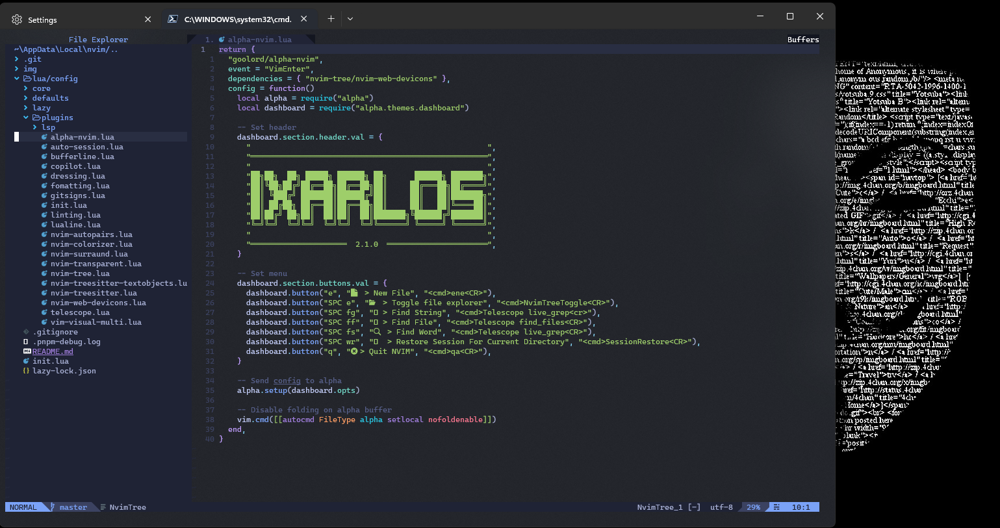

# 🚀 Neovim Development Environment

A powerful and efficient Neovim configuration designed for modern web development, featuring:

- TypeScript, JavaScript, and React support
- [Lazy.nvim](https://github.com/folke/lazy.nvim) package management
- LSP (Language Server Protocol) integration
- Code formatting with Prettier
- Integrated snippets
- Status line with Lualine
- Git integration
- Comprehensive linting
- And much more...

## About

This configuration builds upon the excellent work of [josean-dev](https://github.com/josean-dev/dev-environment-files), [ThePrimeagen](https://github.com/ThePrimeagen/init.lua), and [miltonllera/config](https://github.com/miltonllera/neovim-config). I've customized the keybindings and reorganized plugins to create an optimal environment for TypeScript, JavaScript, and React development.

## Background

After three years of using [coc.nvim](https://github.com/neoclide/coc.nvim), I transitioned to a pure Lua configuration. This change has significantly improved both performance and configurability, giving me better control over each component.

While the original template by [Milton](https://github.com/miltonllera/neovim-config) focused on Linux and macOS, I've expanded it with comprehensive Windows support, as that's my primary development environment.

I've also incorporated select plugins and optimizations from [LunarVim](https://www.lunarvim.org/), resulting in a stable, agile development environment that combines the best of multiple worlds.

This configuration leverages the power of Lua with a carefully curated set of plugins, providing essential features for modern programming through the LSP protocol for intelligent code completion and analysis.

This documentation serves as a comprehensive setup guide for new machine configurations.

## 🛠 Setting up

### Windows



Install [Chocolatey](https://chocolatey.org/install)

```bash
Set-ExecutionPolicy Bypass -Scope Process -Force; [System.Net.ServicePointManager]::SecurityProtocol = [System.Net.ServicePointManager]::SecurityProtocol -bor 3072; iex ((New-Object System.Net.WebClient).DownloadString('https://community.chocolatey.org/install.ps1'))
```

Install [Neovim](https://community.chocolatey.org/packages/neovim#install)

```bash
choco install neovim
```

Install [Git](https://community.chocolatey.org/packages/git)

```bash
choco install git
```

Install [Node](https://nodejs.org/en)

Global packages for npm (update your packages)

```bash
 npm install -g neovim
 npm install -g prettier
```

- Clone the repository inside off this folder or download the last [release](https://github.com/i-xarlos/neovim-config/releases/)

```bash
git clone https://github.com/i-xarlos/neovim-config.git ~/AppData/Local/nvim
```

- Neovim configuration file

```bash
~/AppData/Local/nvim
```

Install [Terminal](https://apps.microsoft.com/store/detail/windows-terminal/9N0DX20HK701?hl=en-us&gl=us)
You can download and install it from the microsoft store and choose your favorite font

Please review [nvim.tressitier](https://github.com/nvim-treesitter/nvim-treesitter/wiki/Windows-support) windows support

```bash
# Mingw toolchain
choco install mingw

# LLVM (Clang)
choco install llvm
```

Optionally:

- Handle packages from [Chocolatey Gui](https://community.chocolatey.org/packages/ChocolateyGUI)

```bash
 choco install chocolateygui
```

- Install NVM to handle node servers [https://community.chocolatey.org/packages/nvm]

```bash
# Install nvm
choco install nvm

# Nvm install node versions
nvm install 16.17.1
```

- NerdFonts https://www.nerdfonts.com/font-downloads

  - [Caskaydia Cove NF] (https://github.com/ryanoasis/nerd-fonts/releases/download/v2.2.2/CascadiaCode.zip) - my favorite
  - [Haslug] (https://github.com/ryanoasis/nerd-fonts/releases/download/v2.2.2/Hasklig.zip)
  - [Firacode] (https://github.com/ryanoasis/nerd-fonts/releases/download/v2.2.2/FiraCode.zip)

- Install [Ninja](https://github.com/ninja-build/ninja/wiki/Pre-built-Ninja-packages) using chocolate `choco install ninja`

  - Follow this [guide](https://github.com/sumneko/lua-language-server/wiki/Getting-Started) for install lua-language-server

  ```bash
   ~AppData\Local\nvim-data\lua-language-server
  ```

### Linux

The first step is to install the correct version of Neovim. Most plugins require version 0.5 or above, but `treesitter` actually requires >= 0.5.1. to work. Version 0.6 has now been relased, which means the previous comment is deprecated. Versions can be installed using `snap`:

```bash
# For stable versions
sudo snap install --beta nvim --classic

# For nightly versions
sudo snap install --edge nvim --classic
```

We also need to install the node package manager `npm` since most language servers are installed that way.

```bash
sudo apt install npm
```

### MacOS

Assume `brew` is installed, then installing Neovim is straighforward:

```bash
# For stable version
brew install neovim

# for nightly version
brew install --HEAD neovim

# To update
brew reinstall neovim
```

Additionally, you may need to configure the `Option` key to behave like `Alt`. In **iTerm2**, this can be done in `Preferences -> Profiles -> Keys`. Change the left option behaviour to `Esc+`. For **kitty**, you need to set `macos_option_as_alt left` (defualt is no) in the terminal's config file. Restarting the terminal (`Command + Q`, then restart) is required for this to take effect.

## ⭐ Installing the configuration

Clone the repo into Neovim's installation folder (usually `/home/<usr>/.config/nvim`):

```bash
git clone https://github.com/i-xarlos/neovim-config.git ~/.config/nvim
cd ~/.config/nvim
```

This will create a folder with the configuration with the following structure is as follows:

```
|- lua
|  |- config/
|       |- core/
|       |- defaults/
|       |- lazy/
|            |- init.lua
|       |- plugins/
\- init.lua
```

This structure is important since Lua will not load files that are not located inside `lua`. The file `init.lua` loads all the modules located inside this folder to set the configuration. Most of the names are self explanatory. The most important file here is `plugins.lua`, which is the module that loads the relevant plugins. Some of the most important plugins are:

1. [**`lazy`**](https://github.com/folke/lazy.nvim): Manage the plugins.
2. [**`lspconfig`**](https://github.com/neovim/nvim-lspconfig): provides a client for the different language servers using the Language Server Protocol (LSP).
3. [**`cmp`**](https://github.com/hrsh7th/nvim-cmp): Auto-complete functionality. Recommended by the core Neovim team.
4. [**`treesitter`**](https://github.com/nvim-treesitter/nvim-treesitter): Syntax highlighting and other functionality.
   - [**`nvim-treesitter-textobjects`**](https://github.com/nvim-treesitter/nvim-treesitter-textobjects): Syntax-aware text objects, selections, and navigation for Neovim.
5. [**`NvimTree`**](https://github.com/kyazdani42/nvim-tree.lua): File explorer written in Lua.
6. [**`gitsigns`**](https://github.com/lewis6991/gitsigns.nvim): Git gutter highlighting and hunk management in buffer.
7. [**`telescope`**](https://github.com/nvim-telescope/telescope.nvim): Fuzzy finder.
8. [**`lualine`**](https://github.com/nvim-lualine/lualine.nvim): A status line written in Lua which is similar to `vim-airline`.

There are some more packages that are dependencies of the ones mentioned above, and some for formatting and theming as well. Adding new plugins is simple with Lazy.nvim:

```lua
return{
  '<author>/<plugin-repo>',
   config = function() require('<plugin-name>').setup({}) end,
}
```

This will load a plugin with its standard configuration. For more complex configurations, we create the relevant file in `lua/config/plugins` (eg. `lua/config/plugins/foo.lua`) and load it using the require function along with any other option we wish to pass on to the Lazy plugin manager:

```lua
return {
  '<author>/<plugin-repo>',
  config = function() require('config/plugins/<plugin-name>') end,
  -- Optionally include dependencies
  dependencies = { '<author>/<required-plugin-repo>' },
  -- Other functionality
}
```

### Additional Plugins and Features

This configuration includes many other powerful plugins that enhance the Neovim experience:

#### User Interface and Experience

1. **[alpha-nvim](https://github.com/goolord/alpha-nvim)**: A customizable greeter/dashboard with a sleek custom header and quick-access menu for common actions.

2. **[oil.nvim](https://github.com/stevearc/oil.nvim)**: A file explorer that lets you edit your filesystem like a buffer, providing a more intuitive way to manage files.

3. **[nvim-autopairs](https://github.com/windwp/nvim-autopairs)**: Automatically inserts matching pairs like brackets, quotes, and parentheses.

4. **[nvim-surround](https://github.com/kylechui/nvim-surround)**: Provides mappings to easily delete, change, and add surroundings in pairs.

5. **[dressing.nvim](https://github.com/stevearc/dressing.nvim)**: Improves the UI for inputs and selects in Neovim, making them more visually appealing.

6. **[bufferline.nvim](https://github.com/akinsho/bufferline.nvim)**: A snazzy buffer line (with tabpage integration) for Neovim.

#### Session Management

1. **[auto-session](https://github.com/rmagatti/auto-session)**: Automatic session management with the following shortcuts:
   - `<leader>wr`: Restore session for current directory
   - `<leader>ws`: Save session for current directory

#### Code Quality and Enhancement

1. **[nvim-lint](https://github.com/mfussenegger/nvim-lint)**: Asynchronous linting for:
   - JavaScript/TypeScript/React: ESLint
   - Python: Pylint
   - Triggers on file open, write, and when leaving insert mode
   - Manual trigger: `<leader>l`

2. **[Comment.nvim](https://github.com/numToStr/Comment.nvim)**: Smart code commenting that supports multiple languages and has both line and block comment capabilities.

3. **[vim-ReplaceWithRegister](https://github.com/inkarkat/vim-ReplaceWithRegister)**: Replace text with register contents using motion (gr + motion).

4. **[nerdcommenter](https://github.com/scrooloose/nerdcommenter)**: Easy code commenting with rich features.

5. **[multi-line](https://github.com/mg979/vim-visual-multi)**: Multiple cursors and multiple selection for efficient text editing.

#### Navigation

1. **[vim-tmux-navigator](https://github.com/christoomey/vim-tmux-navigator)**: Seamless navigation between tmux panes and vim splits using the same shortcuts.

### Plugin Management

Install and update plugins using Lazy.nvim:

```bash
# Open Lazy plugin manager
:Lazy
```

## 📋 Auto-completion

The auto-complete functionality is achieved by using `nvim-cmp` to attach the relevant language servers to the buffers containing code. Most servers only require that the on attach function is specified so that different motions are available. Currently, the common function to attach a server to a buffer is located in `lua/lsp/utils.lua` . It will enable common key mappings for all language servers to display code completion.

### Some further notes

Inline error messages are disabled in the current configuration. They create a lot of clutter. To enable them back, comment the code on line 34 of `lua/options.lua`. This is a `nvim` option related to it's `lsp` interface, not something provided by the servers themselves.

## 🤖 GitHub Copilot Integration

This configuration uses the recommended integration for GitHub Copilot with Neovim:

- The plugins [`zbirenbaum/copilot.lua`](https://github.com/zbirenbaum/copilot.lua) and [`zbirenbaum/copilot-cmp`](https://github.com/zbirenbaum/copilot-cmp) are used.
- Copilot suggestions appear as part of the nvim-cmp completion menu, just like any other completion source.
- You can accept Copilot suggestions with `<Tab>` or `<CR>` (Enter), exactly as you do with LSP or snippet suggestions.
- No special keybindings or hacks are needed—everything is unified in the completion menu.

**How it works:**
1. When you trigger completion (automatically or with `<C-Space>`), Copilot suggestions will show up in the menu, usually with a special icon or label.
2. Use `<Tab>`/`<S-Tab>` to navigate, and `<CR>` or `<Tab>` to accept any suggestion, including Copilot's.
3. Inline ghost text is disabled for a cleaner experience.

**Plugin configuration example:**
```lua
return {
  {
    "zbirenbaum/copilot.lua",
    cmd = "Copilot",
    build = ":Copilot auth",
    config = function()
      require("copilot").setup({
        suggestion = { enabled = false }, -- disables inline suggestions
        panel = { enabled = false },
      })
      vim.g.copilot_no_tab_map = true
    end,
  },
  {
    "zbirenbaum/copilot-cmp",
    dependencies = { "zbirenbaum/copilot.lua" },
    config = function()
      require("copilot_cmp").setup()
    end,
  },
}
```

This approach is robust, future-proof, and recommended by the Neovim and Copilot communities.

## 🔄 Code Formatting

This configuration includes automatic code formatting on save for various languages using [conform.nvim](https://github.com/stevearc/conform.nvim), with special optimizations for performance:

### Supported Formatters

- **JavaScript/TypeScript/React**: Prettier
- **HTML/CSS/JSON/YAML/Markdown**: Prettier
- **Lua**: StyleLua
- **Python**: isort + black
- **Shell Scripts**: shfmt

### Lua Auto-Formatting

Lua files are automatically formatted on save using StyleLua. The configuration includes:

- A custom StyleLua configuration at `~/.config/nvim/utils/linter-config/stylua.toml`
- Performance optimizations to prevent hangs on large files
- Format-on-save functionality that respects file size limits

#### Installing StyleLua

Before the auto-formatting can work, you need to install StyleLua:

**Windows (with Chocolatey):**
```powershell
choco install stylua -y
```

**Windows (manual installation):**
1. Download the latest release from [StyleLua GitHub Releases](https://github.com/JohnnyMorganz/StyLua/releases)
2. Extract the executable to a directory in your PATH
3. Verify the installation with `stylua --version`

**macOS (with Homebrew):**
```bash
brew install stylua
```

**Linux:**
```bash
cargo install stylua
```

#### StyleLua Configuration

The formatter is configured through a `stylua.toml` file. This configuration is automatically set up at:
`~/.config/nvim/utils/linter-config/stylua.toml`

If the configuration file doesn't exist, you can create it manually with the following directory structure:

```
~/.config/nvim/utils/
└── linter-config/
    └── stylua.toml
```

**Creating the configuration file:**

```powershell
# Create directories if they don't exist
New-Item -Path "$env:USERPROFILE\.config\nvim\utils\linter-config" -ItemType Directory -Force

# Create the StyleLua configuration file
@"
# stylua.toml
column_width = 120
line_endings = "Unix"
indent_type = "Spaces"
indent_width = 2
quote_style = "AutoPreferDouble"
call_parentheses = "Always"
collapse_simple_statement = "Never"

[sort_requires]
enabled = true
"@ | Out-File -FilePath "$env:USERPROFILE\.config\nvim\utils\linter-config\stylua.toml" -Encoding utf8
```

**Special commands for Lua:**

- `:StyleLua` - Manually format the current Lua file
- `:StyleLuaConfig` - Open the StyleLua configuration file

#### How the Lua Formatting Integration Works

The auto-formatting on save for Lua files is implemented through several components:

1. **Conform.nvim Plugin**: The main formatter plugin that handles file formatting
   ```lua
   -- In formatting.lua
   formatters_by_ft = {
     -- Other languages...
     lua = { "stylua" },
   }
   ```

2. **Custom AutoCmd for Lua Files**: A specific BufWritePre autocmd that triggers StyleLua formatting for Lua files
   ```lua
   vim.api.nvim_create_autocmd("BufWritePre", {
     pattern = "*.lua",
     callback = function(args)
       -- Only format if file is not too large
       -- ...format with stylua...
     end,
   })
   ```

3. **User Commands**: Custom commands to manually format files or edit configuration
   ```lua
   -- In commands.lua
   vim.api.nvim_create_user_command("StyleLua", function()
     local file = vim.api.nvim_buf_get_name(0)
     local output = vim.fn.system({ 
       "stylua", 
       "--config-path", 
       vim.fn.expand("~/.config/nvim/utils/linter-config/stylua.toml"), 
       file 
     })
     -- Handle result and reload file
   end)
   ```

### Format on Demand

For any supported file type, you can manually trigger formatting with `<leader>f`.

### Performance Optimizations

- Automatic formatting is skipped for very large files (>500KB)
- Heavy formatters like Prettier have stricter limits (>200KB files are skipped)
- Files with more than 3000 lines are skipped for automatic formatting
- Format-on-save has a 1-second timeout to prevent editor hangs
- Slow formatters are automatically detected and moved to format-after-save

## 🔧 LSP, Formatters, and Linters Management

This configuration uses [Mason](https://github.com/williamboman/mason.nvim) to easily manage Language Server Protocols (LSP), formatters, and linters. Mason provides a convenient user interface to install, update, and manage these tools directly from within Neovim.

### Pre-configured Tools

#### Language Servers
- TypeScript (`ts_ls`)
- HTML (`html`)
- CSS (`cssls`)
- Tailwind CSS (`tailwindcss`)
- Svelte (`svelte`)
- Lua (`lua_ls`)
- GraphQL (`graphql`)
- Emmet (`emmet_ls`)
- Prisma (`prismals`)
- Python (`pyright`)

#### Formatters
- Prettier (JavaScript, TypeScript, HTML, CSS, JSON, Markdown, etc.)
- StyleLua (Lua)
- isort (Python import sorting)
- black (Python)
- shfmt (Shell scripts)

#### Linters
- ESLint (JavaScript/TypeScript)
- Pylint (Python)

### Managing LSP and Tools

- To open Mason's interface: `:Mason`
- To install a new language server: `:MasonInstall <server-name>`
- To see installed servers: `:Mason`
- To update all tools: `:MasonUpdate`

### Mason Configuration

Mason is set up to automatically install and configure the specified language servers and tools. If you want to add more servers, you can modify the `mason.lua` configuration file:

```lua
mason_lspconfig.setup({
  -- list of servers for mason to install
  ensure_installed = {
    "ts_ls",
    "html",
    -- Add more servers here
  },
})

mason_tool_installer.setup({
  ensure_installed = {
    "prettier", -- prettier formatter
    "stylua", -- lua formatter
    -- Add more tools here
  },
})
```

## Web-dev Icons

To visualize fancy icons and separators, a patched font must be installed. [Nerd Fonts](https://github.com/ryanoasis/nerd-fonts) has many already patched and offers instructions on how to create new ones (I don't recommend). To install a patched font follow these instructions:

1. Head to the [repo](https://github.com/ryanoasis/nerd-fonts) and download the font. I use Robot Mono.
2. Copy the file to the relevant folder:

- Linux: `~/.local/share/fonts/`.
- MacOS: `/Library/Fonts'`.

3. Change the font in the terminal emulator's settings to the patched font.

Yaml issues:
Please verify: https://github.com/nvim-treesitter/nvim-treesitter/issues/3587

### Nerd Fonts with Kitty

If using `kitty` as default terminal, then the procedure above won't work. First, `kitty` does not support non-monospaced fonts due to how it renders text. Second, the fonts cannot be patched. In fact, kitty takes care of patching on it's own which is great. To install the fonts follow the instructions in this [blog](https://erwin.co/kitty-and-nerd-fonts/#symbols), which are straighforward.

TL;DR for `MacOS`:

1. Download and install the fonts and put the file `Symbols-2048-em Nerd Font Complete.tff` (or whatever subset you decide to use) in the `Library/Fonts/` folder for system wide use, or the local variant.
2. If the glyphs aren't displayed by default, then they can be specified manually by following the instructions.
3. Refresh the fonts cache.

## 📗 Shortcuts:

If you need more information you can find more shortcuts in `options.lua` and `keymaps.lua`:

```
|- lua
|  |- core/
|  |  | - options.lua
|  |  | - keymaps.lua
```

### Some of the most used shortcuts:

Vim is very complete and extensive in its utilities, here I put the ones that I use most commonly and have been customized in this configuration.

| Keys         | Description                                         |
| ------------ | --------------------------------------------------- |
| [Leader]     | Space                                               |
| [Leader-e]   | Open NvimTree (Toggle)                              |
| [Leader-f-f] | Telescope find in files                             |
| [Leader-f-b] | Telescope find in buffers                           |
| [Leader-f-g] | Telescope find text (live grep)                     |
| [Leader-g-i] | Lua go to implemetation (live grep)                 |
| [Leader-g-r] | Telescope go to reference (live grep)               |
| [Leader-f]   | Quick lsp format                                    |
| [Leader-cc]  | Comment code block (visual selected text)           |
| [Leader-cu]  | Uncomment code block (visual selected text)         |
| [TAB]        | Select autocomplete element / Change Buffer (Right) |
| [S-TAB]      | Select autocomplete element / Change Buffer (Left)  |
| [C-n]        | Highlighting word                                   |
| [K]          | Show documentation / Close autocomplete             |
| [k-j]        | Escape                                              |
| [C-c]        | Close Buffer                                        |
| [C-s]        | Save document                                       |
| [g-g]        | Move cursor to document top                         |
| [G-G]        | Move cursor to document bottom                      |
| [A-h]        | Jump to left (Buffer)                               |
| [A-j]        | Jump to bottom (Buffer)                             |
| [A-k]        | Jump to top (Buffer)                                |
| [A-l]        | Jump to right (Buffer)                              |

### Plugin-specific Shortcuts:

#### Oil.nvim (File Explorer)

| Keys    | Description                                     |
| ------- | ----------------------------------------------- |
| `<CR>`  | Select/Open file or directory                   |
| `-`     | Navigate to parent directory                    |
| `<C-p>` | Preview file                                    |
| `<C-c>` | Close Oil                                       |
| `<C-l>` | Refresh the file list                           |
| `g?`    | Show help                                       |
| `g.`    | Toggle hidden files                             |
| `gx`    | Open file with external program                 |
| `gs`    | Change sort order                               |

#### Auto-session

| Keys          | Description                   |
| ------------- | ----------------------------- |
| `<leader>wr`  | Restore session for directory |
| `<leader>ws`  | Save session                  |

#### Alpha Dashboard

| Keys        | Description                      |
| ----------- | -------------------------------- |
| `e`         | Create a new file                |
| `SPC e`     | Toggle file explorer             |
| `SPC ff`    | Find file                        |
| `SPC fs`    | Find string                      |
| `SPC fg`    | Find word                        |
| `SPC wr`    | Restore session                  |

#### Linting

| Keys        | Description                      |
| ----------- | -------------------------------- |
| `<leader>l` | Trigger linting for current file |

### Treesitter Text Objects:

This configuration includes the [nvim-treesitter-textobjects](https://github.com/nvim-treesitter/nvim-treesitter-textobjects) plugin that provides syntax-aware text objects. These text objects make it easier to select, delete, change, or operate on specific code structures.

Unlike Vim's built-in text objects which are based on simple patterns, Treesitter text objects are powered by Treesitter's understanding of code structure. This means they work reliably across languages and properly handle nested structures, making code editing much more precise and efficient.

#### Selection Text Objects:

| Keys | Description |
|------|-------------|
| `a=` | Select outer part of an assignment region |
| `i=` | Select inner part of an assignment region |
| `a:` | Select outer part of a parameter/field region |
| `i:` | Select inner part of a parameter/field region |
| `ai` | Select outer part of a conditional region |
| `ii` | Select inner part of a conditional region |
| `al` | Select outer part of a loop region |
| `il` | Select inner part of a loop region |
| `ab` | Select outer part of a block region |
| `ib` | Select inner part of a block region |
| `af` | Select outer part of a function region |
| `if` | Select inner part of a function region |
| `ac` | Select outer part of a class region |
| `ic` | Select inner part of a class region |

#### Object Swapping:

| Keys | Description |
|------|-------------|
| `<leader>on` | Swap object under cursor with next |
| `<leader>op` | Swap object under cursor with previous |

**Usage examples:**
- `yaf` - Yank (copy) an entire function including its signature and braces
- `dif` - Delete the inner part of a function (just the body, preserving signature)
- `cac` - Change an entire class (delete and enter insert mode)
- `vai` - Visually select an entire if statement

## Commands:

| Command           | Description                                |
| ----------------- | ------------------------------------------ |
| `:vs`             | Create vertical split                      |
| `:split`          | Create horizontal split                    |
| `:StyleLua`       | Format current Lua file with StyleLua      |
| `:StyleLuaConfig` | Edit StyleLua configuration file           |
| `:LspRestart all` | Restart all LSP servers                    |
| `:Mason`          | Open Mason package manager                 |
| `:MasonInstall`   | Install a specific package                 |
| `:MasonUninstall` | Uninstall a specific package               |
| `:MasonUpdate`    | Update all installed packages              |
| `:Oil`            | Open Oil file explorer for current dir     |
| `:SessionSave`    | Save the current session                   |
| `:SessionRestore` | Restore previously saved session           |
| `:Telescope`      | Open Telescope with available pickers      |
| `:Lazy`           | Open Lazy plugin manager                   |
| `:Alpha`          | Show the dashboard                         |
| `:TSUpdate`       | Update Treesitter parsers                  |
| `:TSInstall`      | Install a specific Treesitter parser       |

Some pluggins to try:

- Ranger integration: [Rnvimr](https://github.com/kevinhwang91/rnvimr). Use ranger in a floating buffer instead of as a tiled buffer.
- Different file explorer: [ranger.vim](https://github.com/francoiscabrol/ranger.vim) which can be used to integrate the [Ranger](https://github.com/ranger/ranger) terminal file explorer into Vim.
- Using GBrowse with fugitive: [rhubarb.vim](https://github.com/tpope/rhubarb.vim).
- Prettier quickfix/localist: [trouble.nvim](https://github.com/folke/trouble.nvim).
- Jupyter on Neovim: [jupytext.vim](https://github.com/mwouts/jupytext), [iron.nvim](https://github.com/hkupty/iron.nvim), [vim-textobj-hydrogen](https://github.com/GCBallesteros/vim-textobj-hydrogen). Check this [blog](https://www.maxwellrules.com/misc/nvim_jupyter.html) for more info.

## Attributions

The structre of this config was based on [yashguptaz](https://github.com/yashguptaz/)'s [config](https://github.com/yashguptaz/nvy) and tutorial which helped me understand the basics of using Lua with Neovim.

I've also stolen code from different sources which means it might be hard to acknowledge all of them explicitly though most of them are from the associated plugin's documentation.

## 🔍 Compiling FZF and Telescope for Advanced Search

To maximize the advanced search capabilities in Neovim, it's essential to properly compile the native components of FZF and Telescope. These tools significantly improve search speed compared to pure Lua implementations.

### Windows Prerequisites

1. **GCC and Make**: Required to compile native components.
   ```powershell
   choco install mingw make
   ```

2. **CMake**: Required for some compilation processes.
   ```powershell
   choco install cmake
   ```

3. **Rust** (optional for ripgrep, a fast alternative for text search):
   ```powershell
   choco install rust
   ```

### Compiling telescope-fzf-native

The `telescope-fzf-native.nvim` plugin requires compilation to work properly:

1. **On Windows (PowerShell)**:
   ```powershell
   # Navigate to the plugin directory
   cd $env:LOCALAPPDATA\nvim-data\lazy\telescope-fzf-native.nvim
   
   # Compile using make
   make
   ```

2. **On Linux/macOS**:
   ```bash
   # Navigate to the plugin directory
   cd ~/.local/share/nvim/lazy/telescope-fzf-native.nvim
   # or on macOS
   cd ~/.local/share/nvim/lazy/telescope-fzf-native.nvim
   
   # Compile
   make
   ```

If you encounter problems during compilation on Windows, you can try with CMake:
   ```powershell
   # Navigate to the plugin directory
   cd $env:LOCALAPPDATA\nvim-data\lazy\telescope-fzf-native.nvim
   
   # Create and enter the build directory
   mkdir build
   cd build
   
   # Configure and compile with CMake
   cmake -G "MinGW Makefiles" ..
   cmake --build .
   ```

### Recommended Complementary Tools

To improve the search experience, it's recommended to install:

1. **ripgrep**: A fast alternative to grep.
   ```powershell
   # Windows
   choco install ripgrep
   ```
   ```bash
   # Linux
   sudo apt install ripgrep
   # macOS
   brew install ripgrep
   ```

2. **fd**: A faster and more user-friendly replacement for `find`.
   ```powershell
   # Windows
   choco install fd
   ```
   ```bash
   # Linux
   sudo apt install fd-find
   # macOS
   brew install fd
   ```

### Verifying the Installation

To verify that telescope-fzf-native is correctly compiled and installed:

1. Open Neovim
2. Run the following command:
   ```
   :lua print(require('telescope').extensions.fzf.loaded)
   ```

If it shows `true`, the extension is loaded correctly.

### Common Troubleshooting

- **Error "fzf could not be loaded"**: Verify that the compilation was done correctly using the procedure above.
  
- **Slow search performance**: Make sure ripgrep is installed and properly configured in your PATH.

- **Errors on Windows**: In some cases, you may need to manually compile with GCC:
  ```powershell
  cd $env:LOCALAPPDATA\nvim-data\lazy\telescope-fzf-native.nvim
  gcc -O3 -Wall -Werror -fpic -std=gnu99 -shared src/fzf.c -o build/libfzf.dll
  ```
